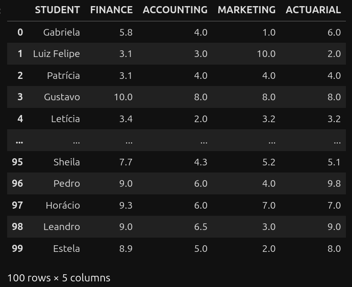
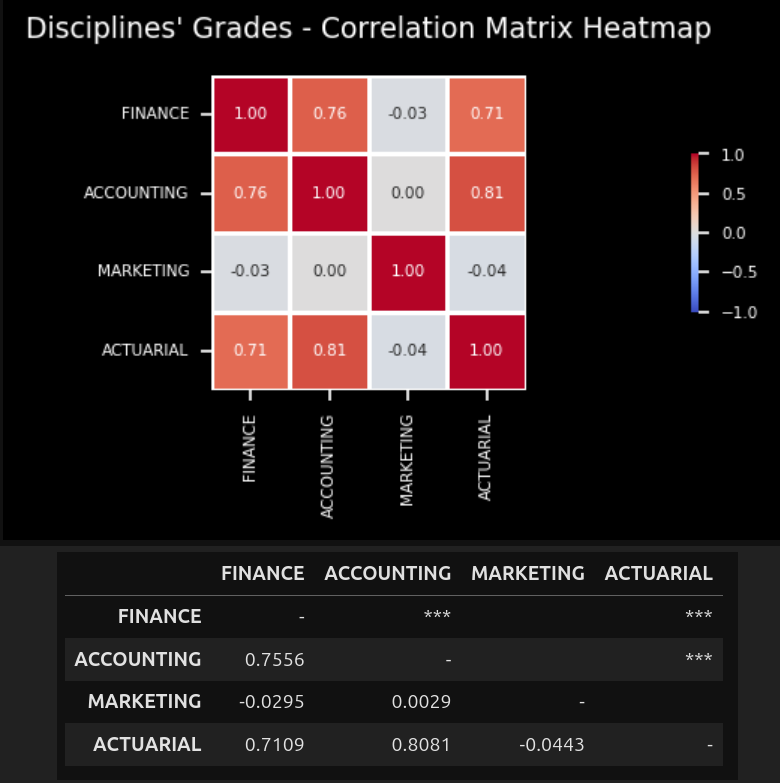
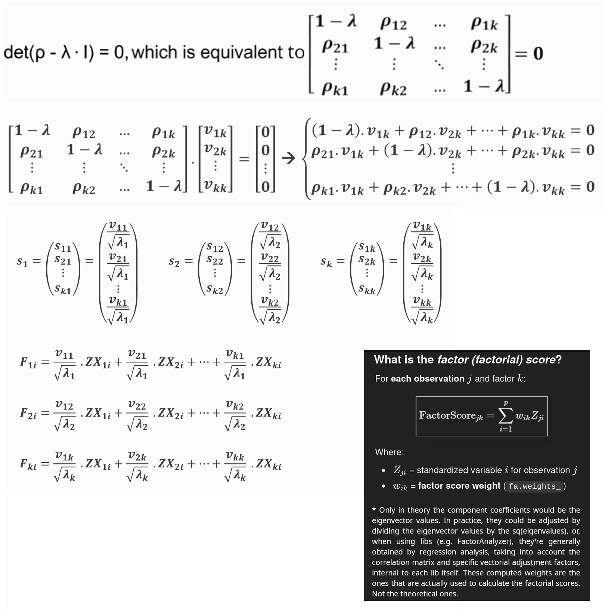
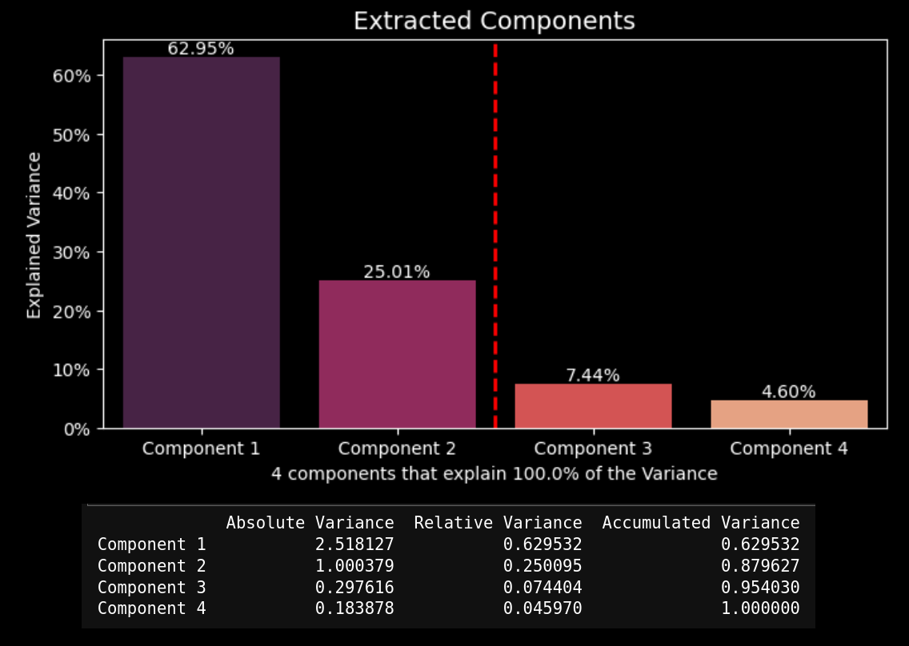
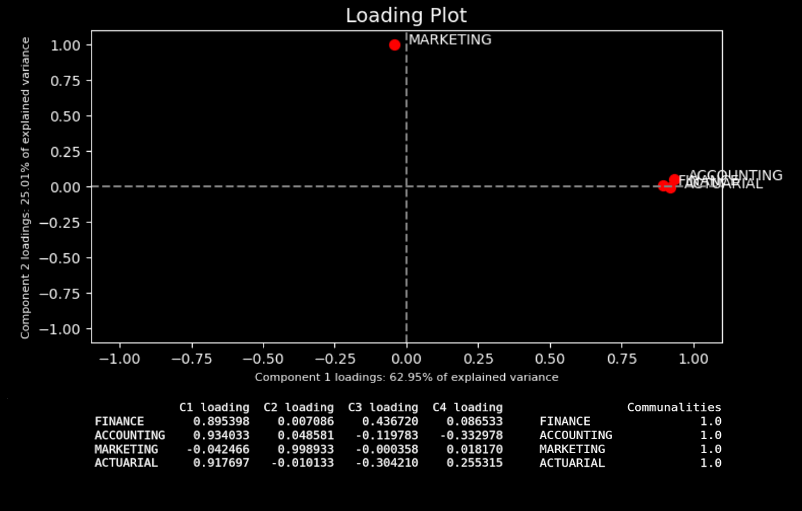
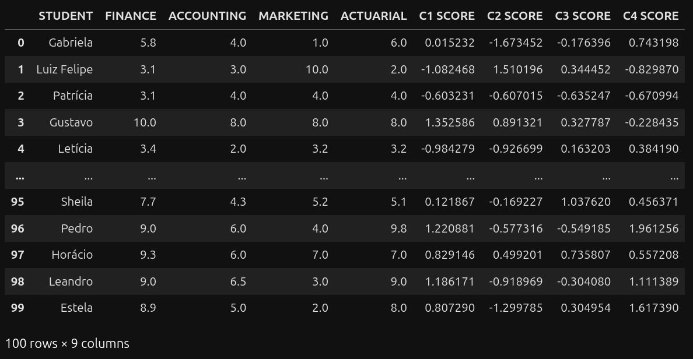
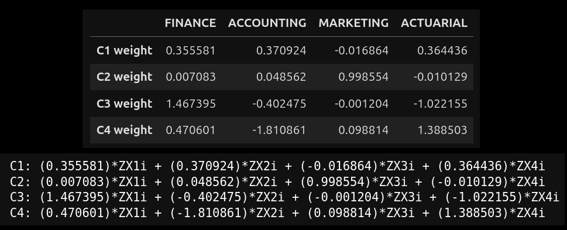
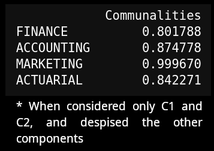
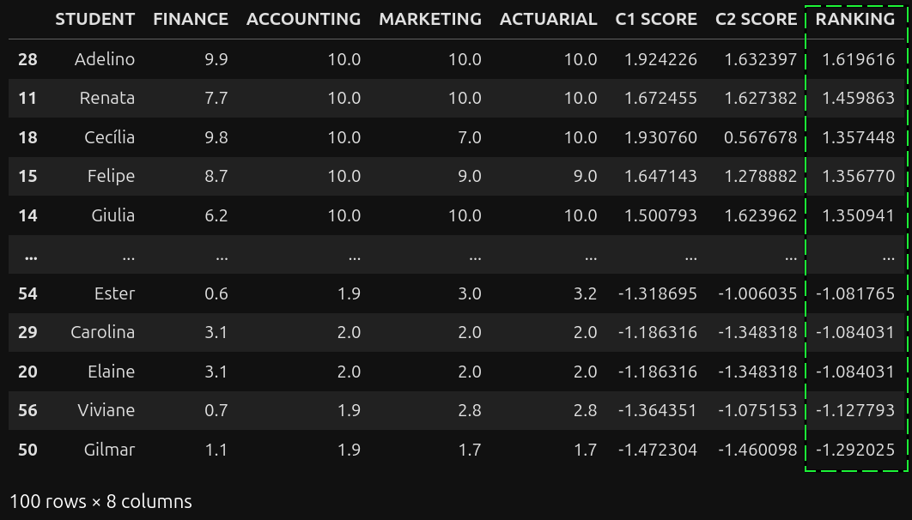

# sample-ml-pca-factorial-analysis
This is a sample Machine Learning project that exemplifies how to proceed Factorial Analysis, following Principal Component Analysis (PCA) methodology, using Python, Pandas, NumPy, SciPy, Scikit-learn, Factor-Analyzer, Sympy, Pingouin, PyShp, Matplotlib, Seaborn and Plotly, along with Anaconda managed environments

© 2026 Daniel Pinheiro Maia All Rights Reserved 
(see Copyright© License at the end of this text).

[**Description of this repository**] 
This is a sample Machine Learning project that exemplifies how to proceed Factorial Analysis, following Principal Component Analysis (PCA) methodology, using Python, Pandas, NumPy, SciPy, Scikit-learn, Factor-Analyzer, Sympy, Pingouin, PyShp, Matplotlib, Seaborn and Plotly, along with Anaconda managed environments.

[**Content**] 
GitHub jupyter notebook | Colab dynamic code import and run:

**Students' Grades**

GitHub: [https://github.com/danielpm1982/sample-ml-pca-factorial-analysis/blob/master/sample-ml-pca-factorial-analysis-students.ipynb](https://github.com/danielpm1982/sample-ml-pca-factorial-analysis/blob/master/sample-ml-pca-factorial-analysis-students.ipynb) 
Colab: [https://colab.research.google.com/github/danielpm1982/sample-ml-pca-factorial-analysis/blob/master/sample-ml-pca-factorial-analysis-students.ipynb](https://colab.research.google.com/github/danielpm1982/sample-ml-pca-factorial-analysis/blob/master/sample-ml-pca-factorial-analysis-students.ipynb) 

[**Source Code and Run**] 
Source code available at github.com, through the following link: 
[https://github.com/danielpm1982/sample-ml-pca-factorial-analysis](https://github.com/danielpm1982/sample-ml-pca-factorial-analysis)  
The source code includes the Jupyter Notebooks .ipynb files themselves (one for each example), static resources - as images, .csv data files, as well as the environment.yml file, which can be used to generate an Anaconda environment for running this project locally (don't forget to customize the env paths to your own filesystem and OS when creating the environment). 
You can also run this Jupiter Notebook project remotely at [https://colab.research.google.com/notebook](https://colab.research.google.com/notebook), importing the content directly from this github repository to your Colab account, without having to create any Anaconda environment locally.

[**Printscreen samples**] 

[**Support**] 
If you have any suggestion or correction about the content of this repository, please, feel free to open an issue at the project issues' section: 
https://github.com/danielpm1982/sample-ml-pca-factorial-analysis/issues

[**Copyright© License**] 
© 2026 Daniel Pinheiro Maia All Rights Reserved 
This GitHub repository - and all code (software) available inside - is exclusively for academic and individual learning purposes, and is **NOT AVAILABLE FOR COMMERCIAL USE**, nor has warranty of any type. You're authorized to fork, clone, run, test, modify, branch and merge it, at your own risk and using your own GitHub account, for individual learning purposes only, but you're **NOT ALLOWED to distribute, sublicense and/or sell copies of the whole or of parts of it** without explicit and written consent from its owner / author. You can fork this repository to your individual account at GitHub, clone it to your personal notebook or PC, analyse, run and test its code, modify and extend it locally or remotely (exclusively at your own GitHub account and as a forked repository), as well as send issues or pull-requests to this parent (original) repository for eventual approval. GitHub is in charge of explicitly showing whom this respository has been forked from. **If you wish to use any of this repository content in any way other than what is expressed above, or publish it anyway or anywhere other than as a forked repository at your own GitHub account, please contact this repository owner / author** using GitHub or the contact info below. For the meaning of the technical terms used at this license, please refer to GitHub documentation, at https://help.github.com/en/github .

[**Owner and Author of this GitHub Repository**] 
Daniel Pinheiro Maia 
[danielpm1982.com](https://www.danielpm1982.com) 
danielpm1982@gmail.com 
[linkedin.com/in/danielpm1982](https://www.linkedin.com/in/danielpm1982) 
Brazil 
.
